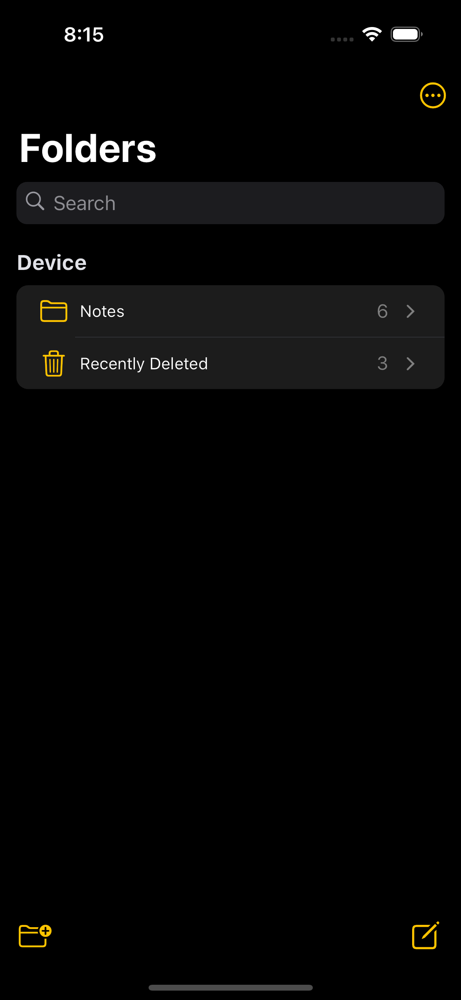
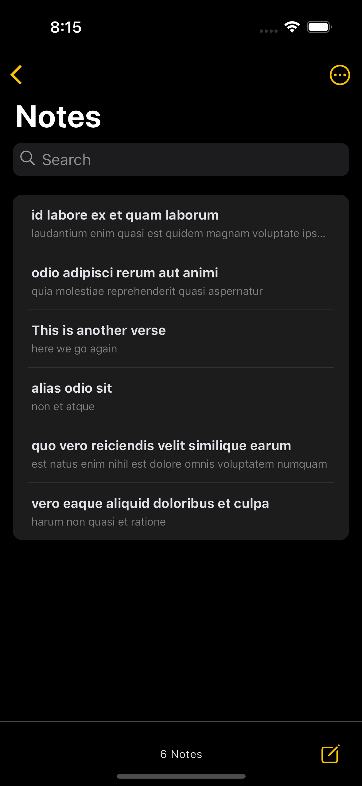
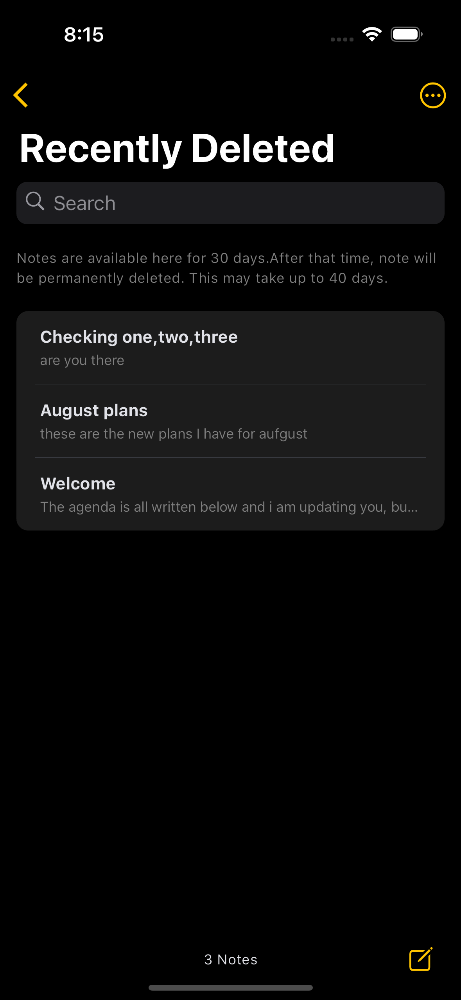
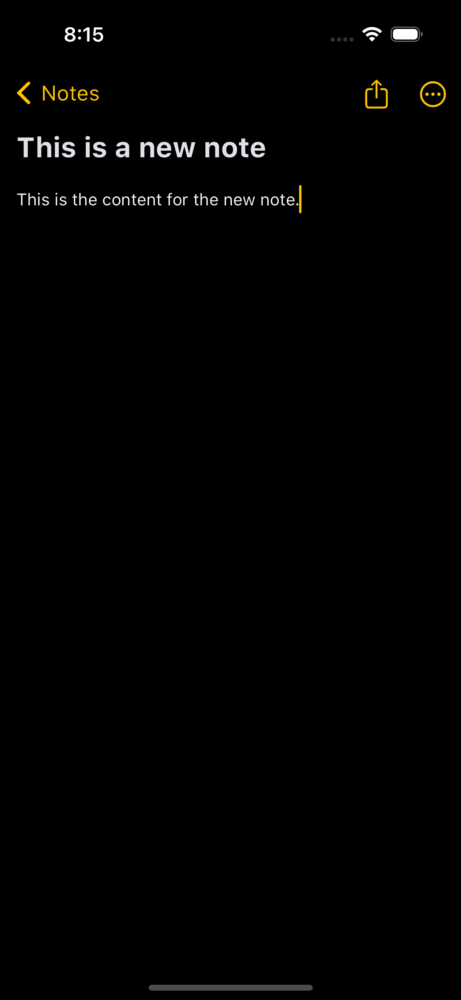
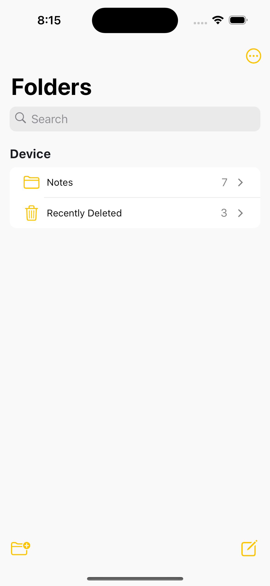
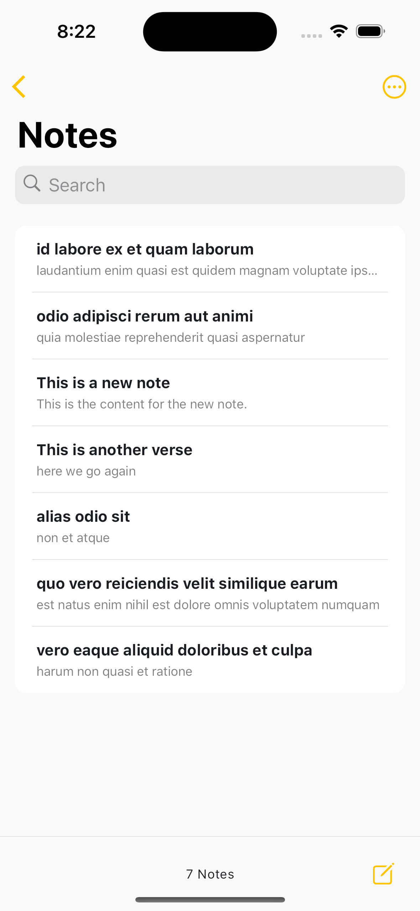
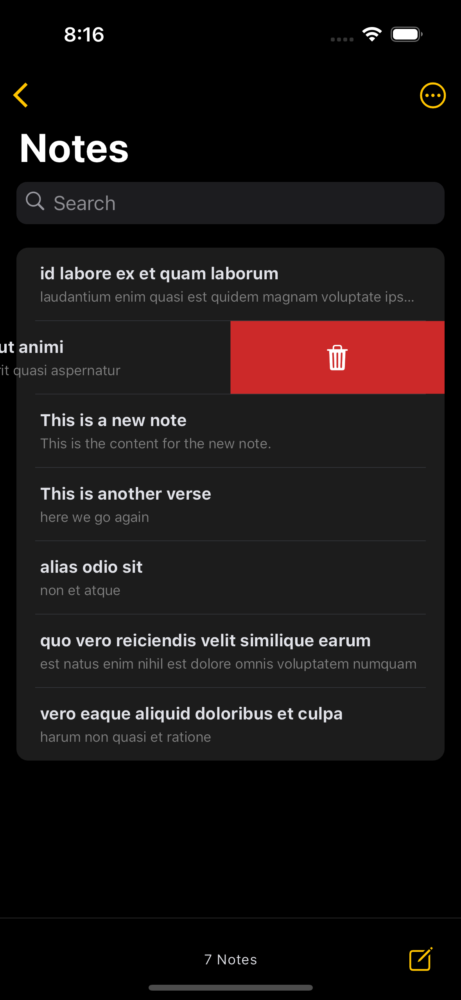
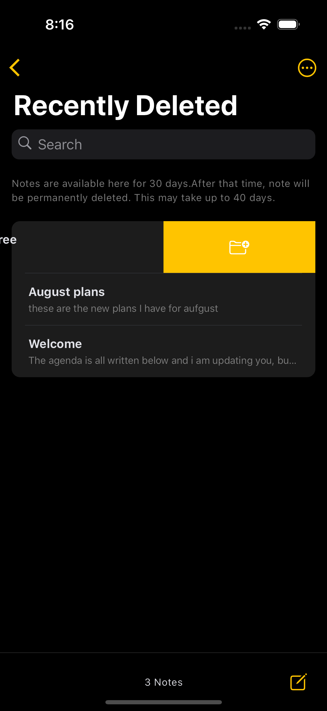

# Papyrus Mobile Engineer Assessment

## View Application

<!-- 1. Find the apk file [here](https://drive.google.com/drive/folders/1B1wC6KfUBXJhunGT8nv3st-ds26IXzyY?usp=sharing)  -->

## Installation

1. Make sure you have [Flutter](https://flutter.dev/docs/get-started/install) and its dependencies installed on your device.
2. Clone the repository: `git clone https://github.com/yourusername/my-app.git`
3. Go to the project directory: `cd my-app`
4. Run `flutter pub get` to install the dependencies.
5. Run `flutter run` to start the app on an emulator or connected device.

## User Interface
The application features the design principle "Component Driven Design" which enables a clean and user-friendly interface, with widgets broken down into several "Components", then components into "Atoms", following the DRY principle to enable easier code maitenance and readability.

## Technical details
- The notes app is built with Flutter UI toolkit, written with the Dart programming language.
- The interface inspiration is the "Apple Notes".
- The app uses "HIVE" for local storage of notes.
- It demonstrates online notes fetched using Dio.
- The major state management used is Riverpod & Flutter Hooks.
- They are based on the  a declarative programming paradigm and embraces the concepts of reactive programming and functional programming.
- The app intends to follows functional, object oriented and reactive paradigms.

## Feature Interface (Demo)
- [x] Folders page
- [x] Notes Page
- [x] Recently Deleted Notes
- [x] Create note
- [x] Folders page (light mode)
- [x] Delete Note
- [x] Restore deleted notes

## Screenshots

| Folders page | Notes page | 
|    :---:     |     :---:      |  
|    |    |

| Recently deleted page  | Create note page  | 
|    :---:     |     :---:      |  
|    |    |

| Folders(light mode)  | Notes(light mode)  | 
|    :---:     |     :---:      |  
|    |    |

| Delete note  | Transaction detail  | 
|    :---:     |     :---:      |  
|    |    |